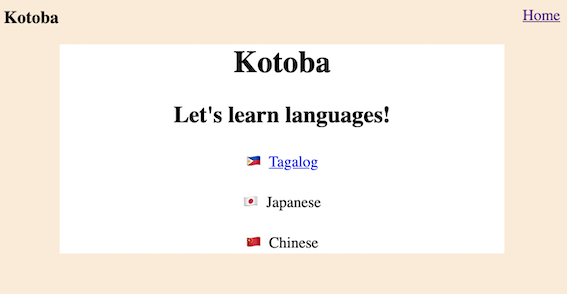

# Kotoba

This is wordbook app.  
It is for learning language!  


## Getting started

To get started with the app, clone the repo and then install the needed gems:

```
bundle install --without production
```

Next, migrate the database:

```
rails db:migrate
```

Finally, run the test suite to verify that everything is working correctly:

```
rails test
```

If the test suite passes, you'll be ready to run the app in a local server:  
Server will run http://localhost:3000/

```
rails server
```

Create migrate

```
rails generate model User name:string email:string
```

Run migration

```
rails db:migrate
```

Run migration on heroku

```
heroku run rails db:migrate
```

Create controller

```
rails generate controller Users new
```
